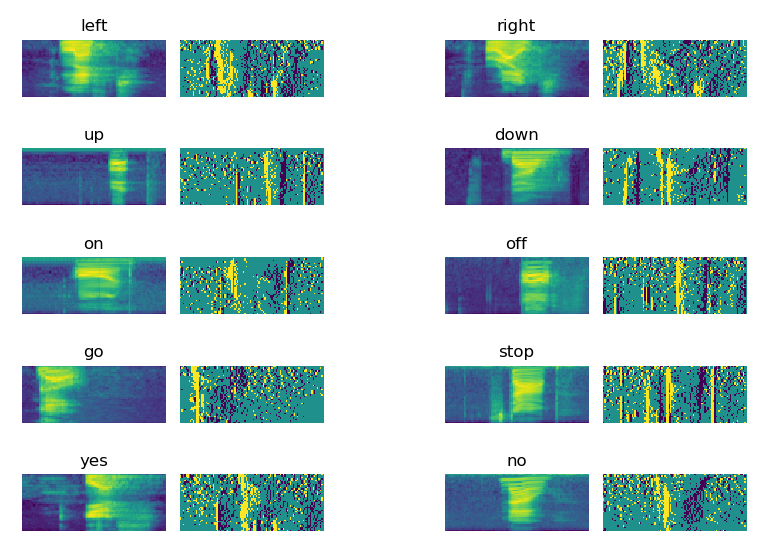

# binary_speech_features
Binary Speech Features for Keyword Spotting Tasks.

## Description

This respository contains the code to compute the ternary 1-channel power-variation spectrogram found in the conference article (https://www.isca-speech.org/archive/Interspeech_2019/pdfs/1877.pdf). This representation is meant to offer a simplified representation of speech for quantized networks. 

## Requirements

* Python (Tested with v3.7)
* Numpy (Tested with v1.18.1)
* Matplotlib (Tested with 3.1.2)
* PyTorch (Tested with v1.6.0)
* Torchaudio (Tested with v0.6.0)

## Power-variation spectrogram

To see examples of this representation, run the main.py script using these commands:

    cd src/
    python -i main.py

10 samples from the Google Speech commands dataset (https://ai.googleblog.com/2017/08/launching-speech-commands-dataset.html) were used to generate these images. The main.py script should output this:

{:height="70%" width="70%"}

The implementation of the power-variation spectrogram can be found in:

src/AudioPreprocessor.py -> See compute_binary_spectrogram() method.

## Reference

If you ever want to cite this work, please use the following Bibtex citation:

    @article{riviello2019binary,
      title={Binary Speech Features for Keyword Spotting Tasks},
      author={Riviello, Alexandre and David, Jean-Pierre},
      journal={Proc. Interspeech 2019},
      pages={3460--3464},
      year={2019}
    }

Thank you!
